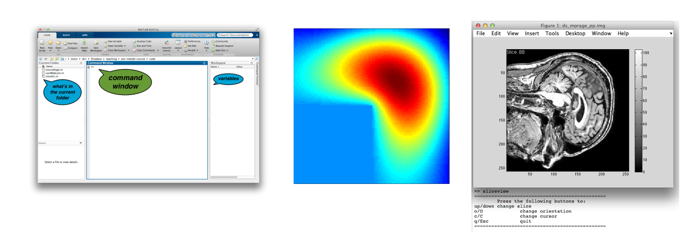
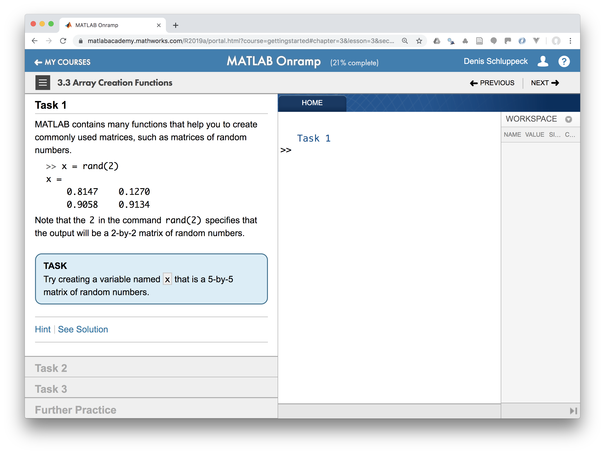
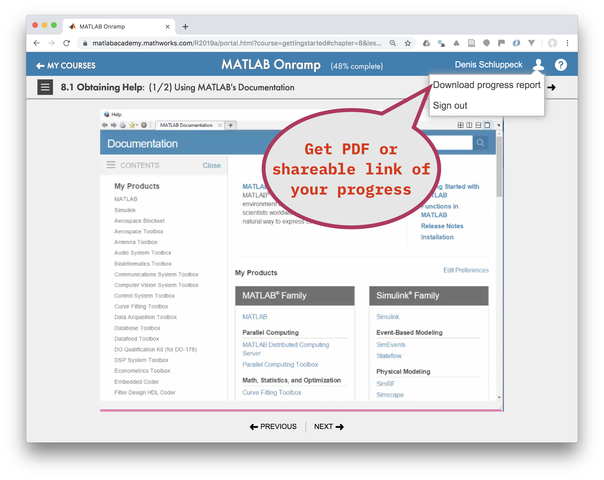

# learningMatlab





## What's this?

Materials and exercises from the *Introduction to Matlab Programming* course which forms part of our [*MSc Cognitive Neuroscience*](https://www.nottingham.ac.uk/pgstudy/courses/psychology/cognitive-neuroscience-msc.aspx).

For **viewing** the materials use: <a href="http://schluppeck.github.io/learningMatlab/">
http://schluppeck.github.io/learningMatlab/</a>

For inspecting the code and details: <a href="https://github.com/schluppeck/learningMatlab">https://github.com/schluppeck/learningMatlab</a>

## Preliminaries

- :ballot_box_with_check:  **Create a (free) account at [The Mathworks](https://uk.mathworks.com/mwaccount/register).** Using your university e-mail address will allow you to use the university's academic license. As an added bonus, you'll be able to install Matlab on your own computer / laptop (MacOS, Windows, or Linux)

- There is a self-directed **Matlab onramp** course that we will refer to during the course. This includes some short videos and interactive lessons, which we will use to [flip the classroom](https://en.wikipedia.org/wiki/Flipped_classroom).

- :ballot_box_with_check: **We'll ask you to complete** [this onramp course](https://matlabacademy.mathworks.com/R2019a/portal.html?course=gettingstarted). The sections should't take too long complete and there are lots of hints to guide you through the material at your own pace.


## Get me started on the material here!

1. The first place to check out is the [aToZ-intro](aToZ-intro). Run through these exercises on the lab machines (or on your own copy of Matlab).

2. Find PDF materials in one place in the [matlab primer [PDF]](aToZ-intro/c84nim-exercises.pdf)

3. Lecture slides for sessions 1-4:
  - <a href="http://schluppeck.github.io/learningMatlab/slides/00-introduction.html" target="_blank">00-introduction.html</a>
  - <a href="http://schluppeck.github.io/learningMatlab/slides/01-getting-started.html" target="_blank">01-getting-started.html</a>
  - <a href="http://schluppeck.github.io/learningMatlab/slides/02-more-vectors+matrices.html" target="_blank">02-more-vectors+matrices.html</a>
  - <a href="http://schluppeck.github.io/learningMatlab/slides/03-indexing-looping-branching.html" target="_blank">03-indexing-looping-branching.html</a>


## Who is it for? What are the aims?

The main aims is to help the students to get to grips with the basic ideas of computer programming and, more specifically, the use of Matlab.  The course materials started out for a graduate course for psychologists and neuroscientists.

The exercises draw on material that students on our *MSc* courses encounter in other modules. It's therefore a great opportunity for hands-on revision of some important concepts such as

- time series data
- images in 2d and 3d
- linear/non-linear regression

The syllabus is for a 10 week (10 x 2h) lab class, assuming very little computer experience (or maths) at the start.

Feel free to use the code. If you feel it's particularly helpful to you... I accept donations in the form of freshly roasted coffee beans.

<script data-name="BMC-Widget" src="https://cdnjs.buymeacoffee.com/1.0.0/widget.prod.min.js" data-id="schluppeck" data-description="Support me on Buy me a coffee!" data-message="Thank you for visiting. You can now buy me a coffee!" data-color="#ff813f" data-position="Right" data-x_margin="18" data-y_margin="18"></script>


The course has two chunks. (Schluppeck has been tinkering with the course more recently and we've also done [a different project around stimulus presentation](README_B.md).

1. an introduction to the basic ideas (variables, functions, control flow) - running over **the first 4 weeks**. Check out the material in the **aToZ-intro** folder and the associated [readme file here.](aToZ-intro)

2. **Timetable A**. A project, building some basic utilities / functions for looking at neuroimaging data and performing linear regression (GLM), **6 weeks**. Details on the imaging-related units is outlined in [here.](imaging-01)


## Timetable A (around a looking at images, 3d data, ...)

| Week | Unit                     | Topic                                                     |
|:-----|:-------------------------|:----------------------------------------------------------|
| 1    | [aToZ-intro](aToZ-intro) | What is Matlab, the environment, variables, indexing, ... |
| 2    | [aToZ-intro](aToZ-intro) | Types of data: numeric, logical, text, etc.               |
| 3    | [aToZ-intro](aToZ-intro) | Indexing, looping, branching, functions, ...              |
| 4    | [aToZ-intro](aToZ-intro) | Understanding someone else's code                         |
| 5a   | [imaging-00](imaging-00) | What are images? How to display them                      |
| 6a   | [imaging-01](imaging-01) | Building / fixing up a simple image viewer                |
| 7a   | [imaging-02](imaging-02) | A function that constructs a simple design matrix         |
| 8a   | [imaging-03](imaging-03) | Hands-on linear regression (using a sample timecourse)    |
| 9a   | [imaging-04](imaging-04) | Doing regression *stats*, displaying                      |


## How to get these materials

Assuming you are on a Mac: open up a ``Terminal`` (double-click /Applications/Utilities/Terminal). Then do the following:

```shell
# if you don't already have one: create a ``matlab`` directory in your home space (``~``), then change directory to it:
cd ~
mkdir matlab
cd matlab
# get MGL (for the behavioral project)
git clone https://github.com/justingardner/mgl.git
# get these tutorials
git clone https://github.com/schluppeck/learningMatlab.git
```

You'll need to add both these subfolders to your path; then you should be good to go. A convenient way to do this is to run this or add this to your ``startup.m`` file:

```matlab
addpath(genpath('~/matlab/'))
```

## Grabbing updates

To make sure you have any updates to this material, open a Terminal, change directory to the ``learningMatlab`` folder and issue ``git pull``. This will sync you the material on github. Alternatively, download the zip archive of the repository.

## Notes

- [getting started with examples](https://uk.mathworks.com/help/matlab/examples.html?s_tid=acb_mlex) - a collection of beginner friendly examples in the Matlab documentation.
- The sections should't take too long complete.

- getting a certificate of your Matlab ONRAMP course progress / completion"


## Colophon

- In the 2015/2016 iteration of the course, I modified the hands-on project for building a simple behavioural task to use **mgl** (https://github.com/justingardner/mgl). Although this requires teaching a couple more details on how stimuli are being displayed by the OpenGL machinery and it's not pure Matlab, it's (a) more realistic and (b) makes displaying different kinds of stimuli, obtaining keyboard responses, etc. much more fun and doable.

- In the 2017 iteration, students built a psychophysical experiment (slightly different task, but similar in spirit)

- In 2018, the assignment for the course was complete and extend an analysis script for fMRI data by writing some helper functions. Students were also using ``pusblish()`` to explore documentation and mixing code with report writing.

## Contact

<a href="https://twitter.com/schluppeck">https://twitter.com/schluppeck</a>
