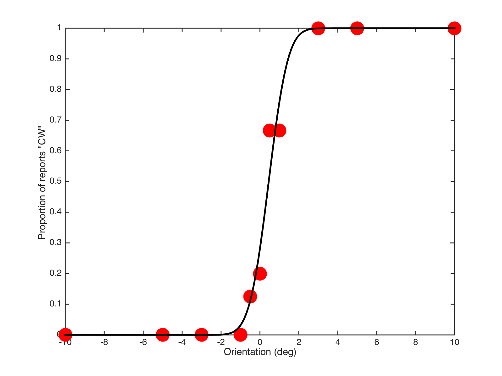

# Worked solution

## Plotting / Fitting with a model curve

The aim is to plot and fit data to achieve something like the following:



1. The file ``summaryData.mat`` contains data to work with. At the command prompt, do the following:

   ```matlab
   load('summaryData.mat') % will load "data"
   data  % find out what's in it.
   ```

2. Plot ``data``, using the numbers in the first column as the x-values, the second column as the y-values.

   ```matlab
   figure
   plot(data(:,1) , data(:,2), 'o', 'markersize',20, 'markerfacecolor', 'b')
   xlabel('Orientation (deg)')
   ylabel('p(CW responses)')
   % and save a copy for your records
   % help print
   % help gcf
   % ... to see why/how the following line works:
   print(gcf, 'myFigure.pdf', '-dpdf')
   ```

3. A "nice" mathematical function / curve, that has such a shape and can be controlled with two convenient parameters is the cumulative version of the *normal distribution* (or *Gaussian* curve).

   ```matlab
   x = -10:0.2:10; % many x values -10....+10
   % plot the CUMULATIVE / s-shaped function with mu=0, sigma=3
   c = normcdf(x, 0, 3);
   figure, plot(x, c , 'r', 'linewidth',2);
   xlabel('x values'); ylabel('y values'); title('normal CDF: \mu=0, \sigma=3');
   ```

4. The 0 and 3 in the above example correspond to the mean (µ) and standard deviation (σ) of a normal distribution. Try plotting the CDF curve for σ = 1 (**magenta curve**) and σ = 5 (**cyan**) on the same plot. Then try changing µ, say µ = -2.5 (**green**) and µ = +3.4 (**blue**). What happens to the curves?

   ```matlab
   x = -10:0.2:10; % many x values -10....+10
   % plot the CUMULATIVE / s-shaped function with other values
   figure
   subplot(1,2,1)
   plot(x, normcdf(x, 0, 3) , 'r', 'linewidth',2);
   hold on
   plot(x, normcdf(x, 0, 1) , 'm', 'linewidth',2);
   plot(x, normcdf(x, 0, 5) , 'c', 'linewidth',2);
   title('changing \sigma')
   subplot(1,2,2)
   plot(x, normcdf(x, 0, 3) , 'r', 'linewidth',2);
   hold on
   plot(x, normcdf(x, -2.5, 3) , 'g', 'linewidth',2);
   plot(x, normcdf(x, +3.4, 3) , 'b', 'linewidth',2);
   title('changing \mu')
   ```

5. The *fitting* problem is: we'd like to know the "best" combination of µ and σ, such that the smooth curve they describe gets as close as possible to the data points. "Close" here means: in such a way that the squared error between the data and the corresponding points on the smooth curve is minimal... the **least squares** solution.

6. **Before** we can hand over the fitting to matlab we need to do the following:

  - we need re-wrap the ``normcdf`` function, so that it accepts the input arguments in a different order. Currently it's: ``y = normcdf( x, mu, sigma )``, where ``x`` are the values for which you want to find the y-values... but really we want it to be ``y = myNormcdf(p, x)``, where ``p = [mu, sigma]`` i.e. the two parameters stuck together in a list / vector. Look at the file [``myNormcdf.m``](myNormcdf.m) for an example of how to do this.

  - we need/may want to calculate the *squared error* between the data (the data-y-values at each point in x) and the model/fit with a particular combination of mu/sigma (also at the corresponding x-values). Look at the file [``sqerror.m``](sqerror.m) for an example of how to do this. **The aim here is to get a single number that summarizes how close our guess of the curve is to the y-values/data**. Our guess of the curve is determined by the choice of µ and σ.

  - just to check what that allows us to do... we can now ask for e.g. ``p=[0, 3.0]`` what is the error between that curve and the data. Next, what if I update the values to ``p=[1.0, 3.0]``... does the error get bigger or smaller? If it gets bigger, we are moving away from a **good value** for ``p``, if the error gets smaller, then the second ``p`` was better!

    ```matlab
    % with data loaded from summaryData!
    e1 = sqerror([0, 3], data(:,1), data(:,2) )
    e2 = sqerror([1.0, 3], data(:,1), data(:,2) )
    % which is better??
    ```  
  - the matlab function ``lsqcurvefit()`` will do this calculation internally and - by trying out many, many settings for ``p``, find the value for it that gives the smallest possible error (the **least squares solution!**).

  - So: to put this all together now, do ``help lsqcurvefit`` to have a look at how this works in general, then try:

    ```matlab
    % with data loaded from summaryData!
    bestP = lsqcurvefit(@myNormcdf, [0, 1], data(:,1), data(:,2))
    % the @ in @myNormcdf is needed to make sure matlab knows you are handing it a
    % function! look at "help function_handle" if you want to know more about this.
    % the [0, 1] is the value for P at which you want to start the whole process
    bestP =
      0.4501    0.7789
    ```

  - now that we have the best choice of ``p`` (stored in ``bestP``), we can use it to calculate the curve at lots of x-values we want:

    ```matlab
    newX = linspace(-10,10, 101); % 101 values between -10 and 10
    % and our myNormcdf() function is perfect for calculating these!
    yFit = myNormcdf(bestP, newX);
    % now plot the data and fit!
    figure
    plot(data(:,1) , data(:,2), 'o', 'markersize',20, 'markerfacecolor', 'b')
    xlabel('Orientation (deg)')
    ylabel('p(CW responses)')
    hold on
    plot(newX, yFit, 'k-', 'linewidth',2)
    ```

  - *Et voilà*

## Back to problem description

[Back to the description / problem set](README.md)
