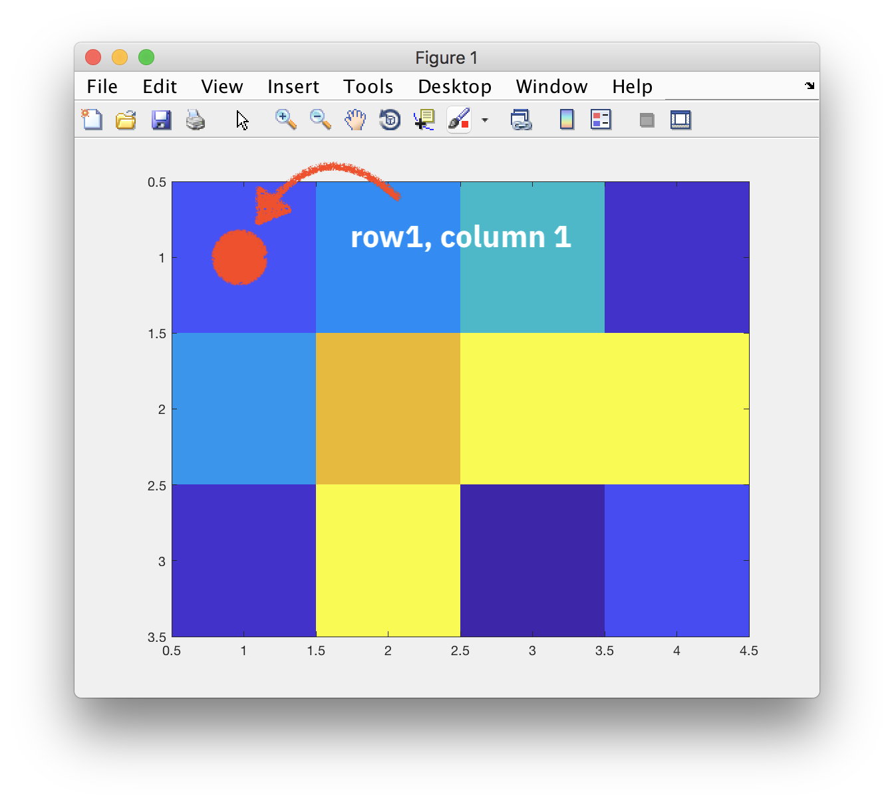
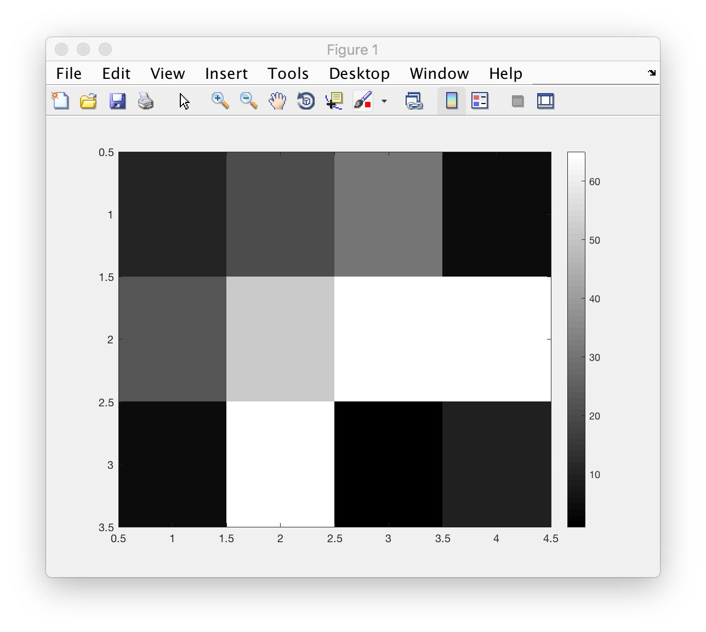

# imaging-00

In this unit we'll get to work with some imaging data (2d, 3d images) and see some of the matlab commands for interacting with and visualising it. Matlab has powerful functions / toolboxes to make this quite direct and I hope I'll be able to show you that you can achieve pretty amazing things with few lines of code -- as long as you know how to go about it (:smile:).

## Learning objectives

understand ...
- how *images* are represented in matlab
- how to display them, inspect different aspects
- the idea of *intensity* images, colormaps
- that there is a wealth of functionality available in the ``Image Processing Toolbox``
- that 3d images (volumetric data) is a natural extension of 2d images

## How are images represented?

You can think of images as a table of numbers. Consider this 3-by-4 example ``A``.

```Matlab
A = [10,20,30,4;
     22,51,72,89;
     4,100,0,9]
```

For larger images (tables with many rows and columns), looking at printed numbers becomes unwieldy. A much better way show this information is to show the numbers as little squares, also called ("pixels" for picture elements).

The following two lines of code

```Matlab
figure   % for a new window
image(A) % display A as an image
```

yield an image representation of the data in which each number is now represented as a colored pixel:


A few things to note:

0. the origin (1st row, 1st column of data) is shown in top left pixel. Compare this to how you think of a scatter plot... where is the origin in plots, usually?
1. note that the centres of each pixel are at 1, 2, 3, ... and each pixel takes up one unit in the x, y direction.
2. by default numbers (the values of each pixel) are mapped to colors
3. the table that defines those colors is called a **colormap**.



The following code displays the same matrix ``A`` as an image, then changes the colormap to ``gray()`` and also displays the colorbar with the correspondence between values and colours.

```Matlab
figure   % for a new window
image(A) % display A as an image
colormap( gray() )
colorbar() % show how values are mapped to colours
```



### Questions

Try to answer the following (and run the appropriate snippets of code). What does it mean? Do you understand what happened? If not, try describe in words what you see...

1. What happens when you run ``gray()`` on the command line.
2. Run ``g = gray()`` - this assigns something (what?) to the variable ``g``. How many rows and columns does ``g`` have?
3. What happens if you call the following:
```Matlab
% make a new figure
figure
% call image() without an input argument
image()
```
4. With the matrix ``A`` from above, try out:
```Matlab
figure(1)
imagesc(A), axis('image')
title()
```


## How to display images, inspect them

```Matlab

```


- how to display them, inspect different aspects
- the idea of *intensity* images, colormaps
- that there is a wealth of functionality available in the ``Image Processing Toolbox``
