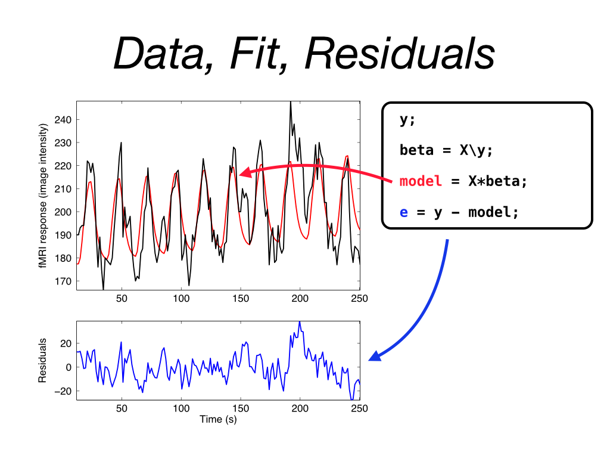

## Aim

In this unit we want to work through an example of linear regression, in particular the *estimation* part.

## Linear regression in action

First, I will walk/talk you through an example of how to load in some data, get a timecourse from a single voxel at a time, the designMatrix and then show the *linear regression* bit in action.

[go to subfolder](./facesVhouses/README.md) and you can also have a look at the [PDF file I produced](./facesVhouses/html/facesVhouses.pdf) from the analysis script using the ``publish()`` feature in Matlab.

## Turning this into a function

If we have time, we can also think about how we can take the logic of the code I wrote in the script into a *function* that takes as inputs
- the name of a data file ``y_filename``
- the name of the design matrix file  ``X_filename``
- the [x, y, z] coordinate in image ``coords``

### Specification

The function ``linRegress()`` should be of the following form:

- ``b = linRegress( y_filename, X_filename, coords)``
- loads in  ``y_filename`` (a nifti file) which provides data and information about timing
  + uses information in ``y_filename`` to make a vector of numbers that specify time (call one ``t_seeconds``, another ``t_volumes``) **discussion point** in your groups! why?? how??
- gets a 1d vector ``y`` from the data stored in ``y_filename`` using the ``coords`` variable (hint: how are x,y,z stored, how can we get them out??). **consider reusing code we wrote last time**?!
- loads in design matrix from ``X_filename``
- finds: ``beta = X\y;``  using backslash operation

- reports ``beta`` values on command line (``disp, sprintf, fprintf``)
- plots ``modelfit = X*beta`` on top of timecourse plot (same figure)

Ultimately, running the following should work

```matlab
cd('facesVhouses');
b = linRegress( 'filtered_func_data.nii', 'designMatrix.txt', [18, 14, 4])
cd('..'); % come back up one folder
```


## Notes

To orient you with some of the calculations, consider the following plot:


