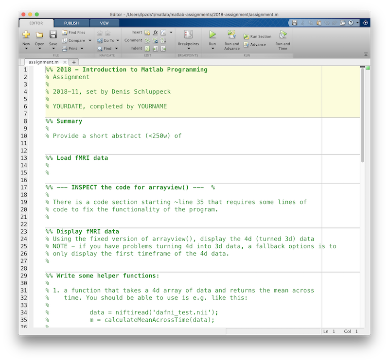

# Introduction to Matlab Programming – PSGY4014
<!-- page_number: true -->

---
# Overview

## People
Dr Denis Schluppeck (convenor)
Dr Riikka Mottonen
Anthony [Kuan] Beh (TA)

---

## What's the plan?

### Today

- overview of course + **administrivia** 
- get comfortable with how to start up `matlab`  + dip our toes :feet: in

### Between classes

- complete "onramp" online
- **you / we / together**: work through some simple problem sets 

---

| Week                   | Topic                                |
|:-----:----------------------------------------------------------|
| 1    |  What is Matlab, the environment, variables, indexing, ... |
| 2    |  Types of data: numeric, logical, text, etc.               |
| 3    |  Indexing, looping, branching, functions, ...              |
| 4    |  Understanding someone else's code                         |
| 5   |  What are images? How to display them                      |
| 6   |  Building / fixing up a simple image viewer                |
| 7   | A function that constructs a simple design matrix         |
| 8   |  Hands-on linear regression (using a sample timecourse)    |
| 9   |  | Doing regression *stats*, displaying                      |

---

## What's the assignment?

> The assessment for this module is an individual programming project.

 

[A description of a previous assignment](2018-assignment.pdf)

---

## Submission details

- submission via moodle page
- all the details will be available in a PDF
- problem will be based on material you **see in class**
- you will have at least 10 days to work on it

- **deadline: close to end of term (TBC)** 

---

## :exclamation: Find a programming buddy (or two)

- for doing in-class problem solving + discussions
- for exercises, you can try "pair-programming" (and alternate)

---

## Setting up computers, logins :fire: ::

- sign up for a **free** account with [The Mathworks](https://www.mathworks.com)
- make sure to use your **university e-mail address**
- checkout [Matlab in the web browser](https://matlab.mathworks.com)
- and/or if you want to have a copy of ``matlab`` installed on your own laptop/computer at home, download and install.

