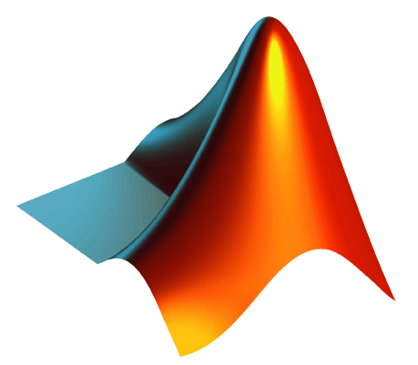
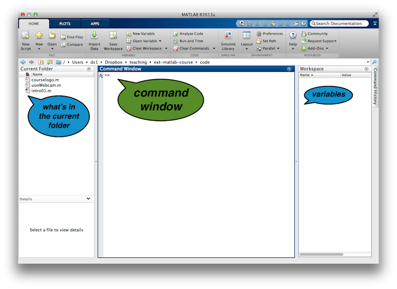

# Getting started

Quick demo of a couple of real-life uses:

- plotting sample data
- loading an image (+ playing around)
- image capture demo


--- 
# Diving straight in

- start **Matlab** by clicking the icon in the dock



- or log on to :arrow_right: https://matlab.mathworks.com/ 

---
# Rest of this session **(1)**

We'll get you kick-started and explain how to:

+ do simple maths with Matlab
+ learn about + create ``variables``
+ change ``variables``
+ :arrow_right: github.com/schluppeck/learningMatlab

---

## The Matlab environment




---


# Important Notation

- ``>>`` to illustrate the Matlab prompt. *Don't type it again*

- ``%`` is the symbol for comments. Things on the line after the symbol 
```matlab
    >> 1 + 1  % this is really silly maths
```
- numbers are written like you'd expect::
```matlab
    >> 129      % a simple "integer"
    >> -4.32    % negative number, with decimals
    >> 1.2e5    % engineering notation. The same as 1.2 * 10.^5
```

--- 
# Some terminology

- **Variables**: a *named placeholder* for something
- Matlab **commands** or **functions** do stuff to *input*s and return an *output*s
- **operators**: really also just functions, but a convenient shortcut for very common jobs ``+ - * /`` etc.

- much more on this later

---

# Doing some maths
add, subtract, multiply, divide numbers like this:


```matlab
>> 1 + 1 - 1    % + and -
```
```matlab
>> 10 .* 5      % use .* and ./ to multiply and divide
```

```matlab
>> 2 .^ 0
>> 2 .^ 8       % use .^ to raise to power
```

---

# ``.*`` *versus* `*` (`/` versus `./`)

- note that the **operators** for multiply and divide are ``.*`` and ``./`` (more on the extra "dot" later)
- use **parenthesess** `( )` to make **order** of operations explicit:

```matlab
>> (10 + 1) .* 9
>>  10 + 1  .* 9   % not the same, WHY?
```
---

# 5 minutes practice

Take 5-10 minutes to do simple maths exercises (first set in the **last section of handout**) and on next slide.

If you get error messages, check your typing and try to understand what's gone wrong

**We'll move around the room to help if you are stuck**

---

# Simple maths
-	3/2
-	value of pi ($\pi$). What do you think this could be called in Matlab?
-	two times pi ($\pi$)
-	2 to the power of 8
-	4 to the power of 3
-	64 to the power of one third
-	**(bonus)** the square root of 81 (not using the ``sqrt()`` function?!)

---

# Variables
- to store the results (and work on them), you can put data in a `variable`

```matlab
>> a = 10   % stores the number 10 in a variable called "a"
>> b = 2+2  % stores the result of 2+2 in "b"
```

- you can now use the variables (or place holders)::
```matlab
>> a .* 2.3 % uses "a"
>> c = a + b    % stores result of a+b in "c"
```

---

# What's in my variables
To get information about `variables`:

- interactive way in `workspace` explorer

- on `command prompt`
```matlab
>> c 	% enter variable name to display
>> who 	% this command shows you variables in "workspace"
>> whos	% ... and with some additional information
>> clear c % to get rid of c
```


---


# Vectors and Matrices

- Matlab is very good with dealing with `vectors` and `matrices` 
- Vectors: **lists of numbers**:
```matlab
>> x = [1, 2, 3]  % a ROW vector
>> y = [4; 5; 6]  % a COLUMN vector
```
- Matrices: **tables of numbers**::
```matlab
>> u = [1, 2, 3 ;
    4, 5, 6]  % a 2 by 3 matrix
```

---
# Defining vectors, list of numbers

Take some time to do the exercises on defining vectors and matrices.

If you get unexpected error messages, take a note and we'll try to help you understand what's gone wrong

**We'll move around the room to help if you are stuck**

---

# Creating Matrices

- fill a matrix with numbers::
```matlab
>> ones(2,5)   % 2-by-5 matrix full of 1
>> zeros(3,3)  % 3-by-3 matrix full of 0
>> rand (100)  % a 100-by-100 matrix of uniform random numbers
```
- many other useful commands::
```matlab
>> randn(5)	% gaussian random numbers (5-by-5 matrix)
>> nan(10)	% not-a-number ... useful in some cases
```

