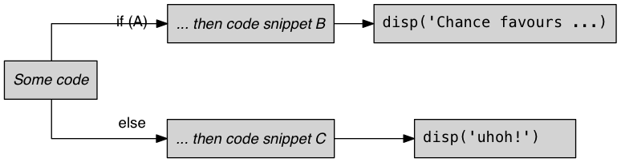
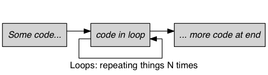

# Index, loop, branch 


**Last time**, we covered lots of material

- basic syntax
- general ideas about programming
- importance of documenting things
- **just trying things out!**

**Today**, we'll try to make this relevant to real application

---

# Logical variables, controls, if/else

- So far: bits of code  get executed *once* with one set of inputs
- sometimes want to do some things in certain *conditions*
- and often we want to do (similar) things *many times over*
- at the heart of this lie **logical** variables, **branching** and **loops**

---

# Logical values & variables

- logical values: ``true`` and ``false``
- these are actually *functions* like ``ones()`` 
```matlab
>> a = true(2,10) % 20 truths ;
```
- ``0`` and ``false`` are equivalent
- non-``0`` and ``true`` are equivalent

---
# Testing if logical values are same

- test for logical equivalence with ``==`` 
```matlab
>> 2 == 5       % is this true?
>> (2+3) == 5   % ... and this?
>> (2 == 5) == false   % what's this?
```
---
# Other comparisons

| relational operatopr (`relop`) | **meaning**          |
|:------------------------------:|:---------------------|
|             ``<``              | is smaller?          |
|             ``<=``             | is smaller or equal? |
|             ``>``              | is bigger?           |
|             ``>=``             | is bigger or equal?  |
|             ``==``             | is equal?            |
|             ``~=``             | is not equal?        |

---

# Combining logical values

- to test whether A **and** B are true: ``A && B``
- ... A **or** B are true: ``A || B``
- `&&` and `||` are binary operators


```matlab
a = rand(1); % one random number between 0,1
% the following is true if 0.3 < a < 0.7
closeToMiddle = (a > 0.3) && (a < 0.7)
```
---

# if / else

Run a part of your script only if some condition (A) is met



---

# if / else in code
```matlab
% make a random number between 0, 1
a = rand(1)

% now test if this time s is > or < than 0.5
if a > 0.5
    disp('chance favours the prepared mind')
else
    disp('uhoh!')
end
```
---

# another example

```matlab

reply = input('Do you want more? Y/N [Y]:','s');

if isempty(reply) || strcmp(reply, 'y')
    % if the reply variable is empty
    % or if the string comparision with lowercase 'y' is true
    reply = 'Y';
end
```
- what do you think `isempty()` does? And `strcmp()` ?

---

# and another example

Often some values for a variable make no sense. E.g. a **negative number of subjects** shouldn't happen!

```matlab
if nSubjects < 0
    disp('number of subjects ill-defined')
elseif nSubjects == 0
    disp('there were 0 subjects')
else
    disp(['there were ' num2str(nSubjects) ' subjects' ])
end
```

---

# Note: other ways of branching

- there is also another way to branch
- ``switch / case`` is sometimes more elegant than ``if / else``
- we'll meet an application of this in exercises

---
# Logical indexing

Sometimes we want logical tests on all elements in an array

In Matlab, the *logical operators* work there, too! 

```matlab
a = rand(10,1)  % a column of 10 random #s
a > 0.5  % a column of 0 (false) and 1 (true)
whereTrue = a > 0.5  % store the information
```

---

# Loops (for...end)

Basic idea of a loop is to repeat some code many times




### Syntax

```matlab
for loopIteration = 1:10
    % on each interation, the variable
    % loopIteration takes on the next value on list
    disp('The current loop count is:')
    loopIteration
end
```

---

# Loops (what's inside)

- allocate space for variables you need fill **before** loop
- don't "grow" arrays (it's memory & time costly)
- try to make the limits of your loops variable(s)::

not great (why?)
```matlab 
for iCounter = 1:10 % AVOID
    ... % and so on
```
better:
```matlab
nIterations = 10; % BETTER
for iIteration = 1:nIterations
    ... % and so on
```
---

# Loops (while)

A different way of looping through data is to use ``while``.

This keeps on running until some condition becomes ``false`` 

```matlab
n = 0;
nCumulative = 0;
while nCumulative < 100
    n  = n + 1;
    nCumulative = nCumulative + n;
    disp(['n: ' num2str(n) ' cumul: ' num2str(nCumulative)])
end
```

