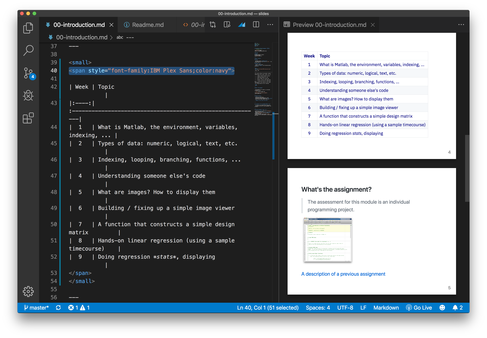

## Notes on making the presentation slides

We use `markdown` for documentation and slides. In particular the `marp` tool hosted at https://github.com/marp-team/marp-cli

To turn these markdown files into a PDF, have a look at the documentation and to convert **all** markdown files in a folder into e.g. `html` files for presentation, run:


```bash
marp *.md --html true --allow-local
``` 

The ``--html true`` flag enables conversion of HTML tags, which makes doing things like shrinking tables with ``<small>`` tags or ``<span style="font-family:Menlo">`` or ``<span style="font-family:IBM Plex Sans;color:navy">``, etc easier.

## when using VS code extension

If / when you install the `marp` extension for `code`, you should go to Preferences and set the `enableHTML` flag to true. 

https://marketplace.visualstudio.com/items?itemName=marp-team.marp-vscode




